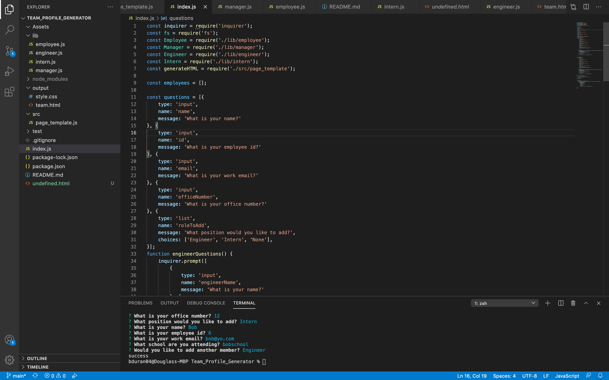

# Team_Profile_Generator 

  ## Table of Contents

1. [Description](#description)
2. [Installation](#installation)
3. [Usage](#usage)
4. [License](#license)
5. [Contributing](#contributing)
6. [Tests](#tests)
7. [Questions](#questions)

## [Description](#description)
This is a command line node.js application that takes in information employees on a software engineering team, then generates an HTML webpage that displays summaries for each person.

`

## [License](#license)
This project is licensed under: 
[None](https://choosealicense.com/licenses/none/)

## [Tests](#tests)
npm run test

## [Questions](#questions)
If you have questions, you can reach me at bduran04@gmail.com. You can find more of my work at [bduran04](https://github.com/bduran04)
